# 计算机图形学 - 绘图系统

**基于 Qt5 ( C++ ) 开发的 计算机图形学 - 绘图系统** (计算机图形学 课程作业)

核心算法模块，完成了直线生成（DDA算法、Bresenham算法），多边形生成，椭圆生成（中点椭圆算法），曲线生成（Bezier和B-spline），图元平移、旋转、缩放，线段剪裁（Cohen-Sutherland算法、Liang-Barsky算法）的实现。GUI程序实现了较为友好的用户交互UI，可以较为方便地画直线、多边形、椭圆、曲线，且可以保存画布、设定颜色、对所有类型的图元进行平移、旋转、缩放、删除。

下载地址：https://github.com/NJU-TJL/CG_Painter/releases/

****

**Copyright © 2020 NJU-TJL**  

**[开放源代码许可](https://github.com/NJU-TJL/CG_Painter/blob/master/LICENSE)**

**转载请注明原作者：https://github.com/NJU-TJL/CG_Painter**  

****

PS：若**图片加载失败**，可访问CSDN博客查看：https://blog.csdn.net/Kingsman_T/article/details/103880164 或者 同步的码云仓库：https://gitee.com/NJU-TJL/TextTagsCloud 

算法实现、设计过程详情，请见于报告（[点击下载](https://github.com/NJU-TJL/CG_Painter/raw/master/doc/%E8%AE%A1%E7%AE%97%E6%9C%BA%E5%9B%BE%E5%BD%A2%E5%AD%A6%20%E7%BB%98%E5%9B%BE%E7%B3%BB%E7%BB%9F_%E8%AE%BE%E8%AE%A1%E6%8A%A5%E5%91%8A.pdf)）：

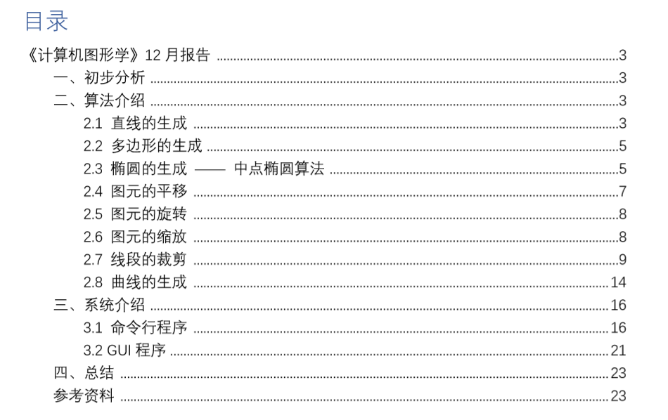

## 系统使用说明书

| 开发工具         | Qt 5.9.8 + Visual Studio 2017                          |
| ---------------- | ------------------------------------------------------ |
| 构建套件（编译） | Desktop Qt 5.9.8 MSVC-2017 64bit（在VS2017中构建项目） |
| 运行环境         | Windows 10                                             |
| 打包工具         | Enigma Virtual Box 9.40 Build 20191010                 |
| 推荐分辨率       | 1920×1080                                              |

**<u>运行说明</u>** 

​		这里已打包生成了.exe文件，直接双击运行CG_Painter_GUI.exe文件即可。

​		运行后的程序界面如下：

（中间为绘图区域；整个主窗口可以放大、缩小，绘图区域的大小也会自动随之变化）

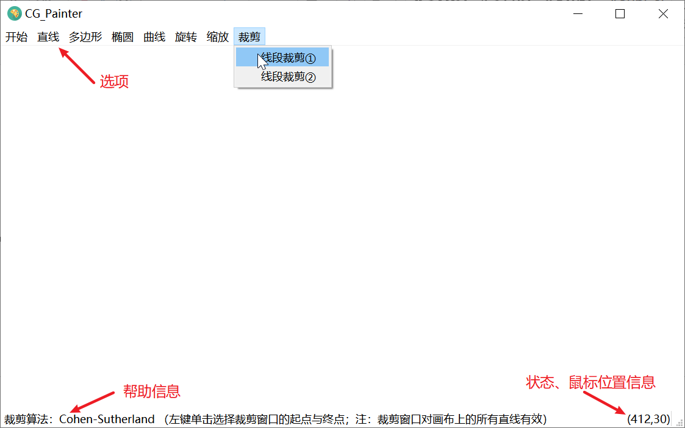

下面对目前程序的功能与操作方式进行详细说明。

### 2.1 开始

单击“开始”选项，可以设定画笔颜色，以及保存当前画布为.bmp文件。

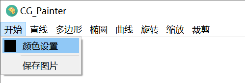

注：这里“保存图片”会在可执行程序同目录下生成.bmp文件。经过测试发现，如果将程序放在桌面（以及C盘中某些系统目录下），可能无法保存生成.bmp文件。若出现此情况，请更改.exe文件的存放位置。

### 2.2 图元拖动平移

非绘图状态下，将鼠标移动到某图元像素点附近（误差允许的范围是一个半径长为4个像素点的圆形区域），按住左键，拖动，即可将图元拖动平移。

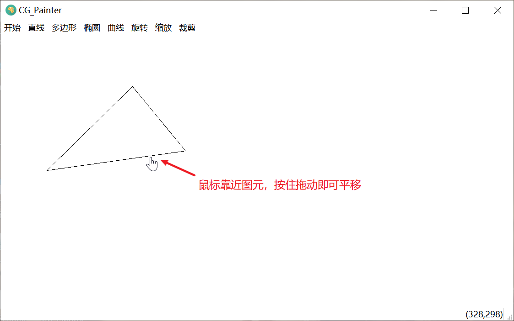

### 2.3 绘制直线

绘制直线，首先要在左上角的选项栏中点击“直线”，然后选择使用的算法，之后就进入了直线的绘制状态（右下角有状态提示）。进入绘制状态后，随时可以按鼠标右键取消绘制。在中间的绘图区域第一次单击鼠标左键，确定直线的第一个端点，之后，随着鼠标的移动，直线动态变化。再次单击鼠标左键，确定第二个端点，绘制结束。

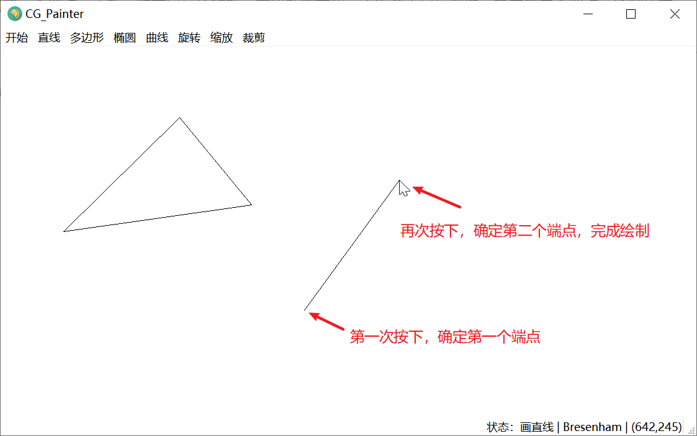

### 2.4 绘制多边形

这里与绘制直线类似，也是需要先在菜单栏选择绘制算法，进入绘制状态。绘图状态中，随时可以按鼠标右键取消绘制。在绘图区域中第一次单击鼠标左键，确定下多边形的第一个顶点。之后的操作与绘制直线的操作类似，依次按下鼠标左键，确定多边形顶点。最后，鼠标靠近多边形的起始点时，会自动贴合，此时单击左键，就完成一个闭合的多边形的绘制，也就绘制结束。

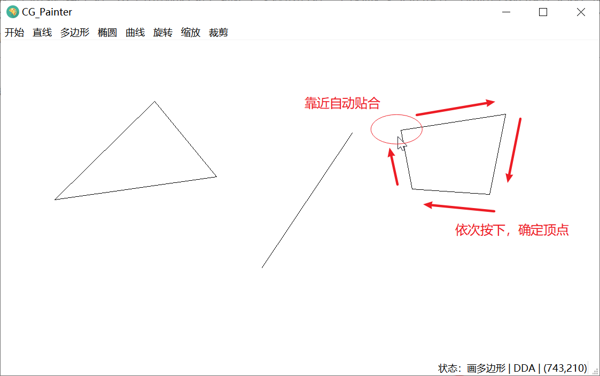

### 2.5 绘制椭圆

这里直接单击左上角选项栏的“椭圆”选项，就进入了椭圆绘制状态。在绘制状态也是随时按下鼠标右键就可以取消绘制。在绘制区域，第一次单击鼠标左键，会以单击位置为中心生成一个默认大小的椭圆。之后，在绘图区域的任意位置，按住鼠标左键，拖动，即可动态调整椭圆的长短轴大小（可多次调整）。调整完毕，只需要在任意位置双击鼠标左键，即可完成绘制。

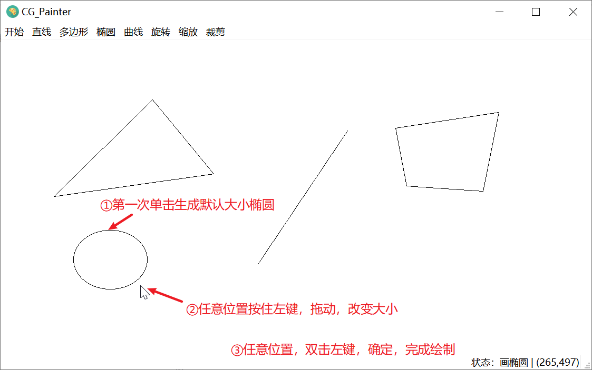

### 2.6 绘制曲线

选项栏单击曲线，选择绘制的曲线类型，进入绘制状态。在绘图区域中依次单击鼠标左键，确定曲线控制点。再任意位置，按下鼠标右键后，完成绘制，生成控制点对应的曲线。完成绘制后，可通过拖动控制点调整曲线形状。

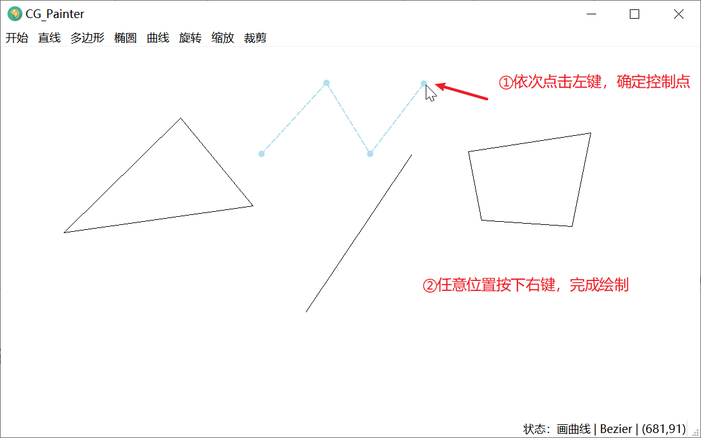

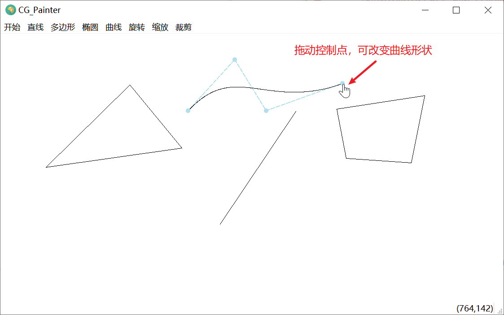

### 2.7 旋转

点击“旋转”选项，进入“旋转图元”状态（右下角提示）。第一次单击后，鼠标位置，出现旋转中心（绿色圆点）。之后，画布上的所有图元（包括椭圆、曲线等），可使用鼠标左键拖动进行旋转。按下右键，退出旋转。

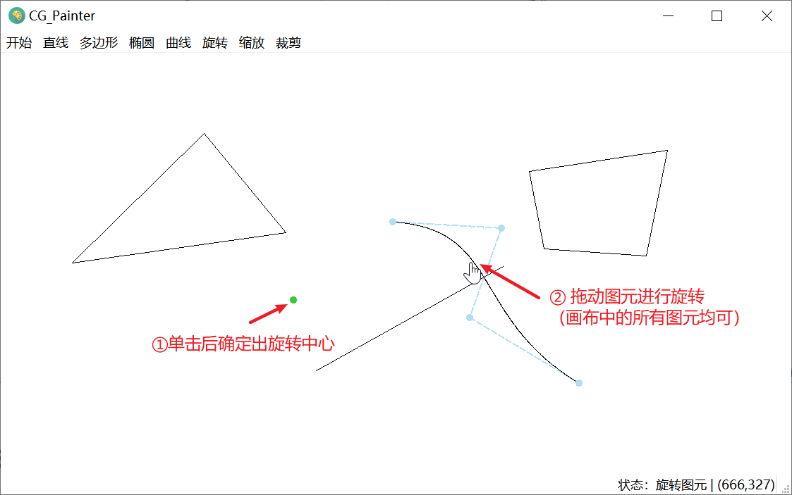

### 2.8 缩放

点击“缩放”选项，进入“缩放图元”状态（右下角提示）。第一次单击后，鼠标位置，出现缩放中心（绿色圆点）。之后，画布上的所有图元（包括椭圆、曲线等），可使用鼠标左键拖动进行缩放（靠近/远离缩放中心）。按下右键，退出缩放。

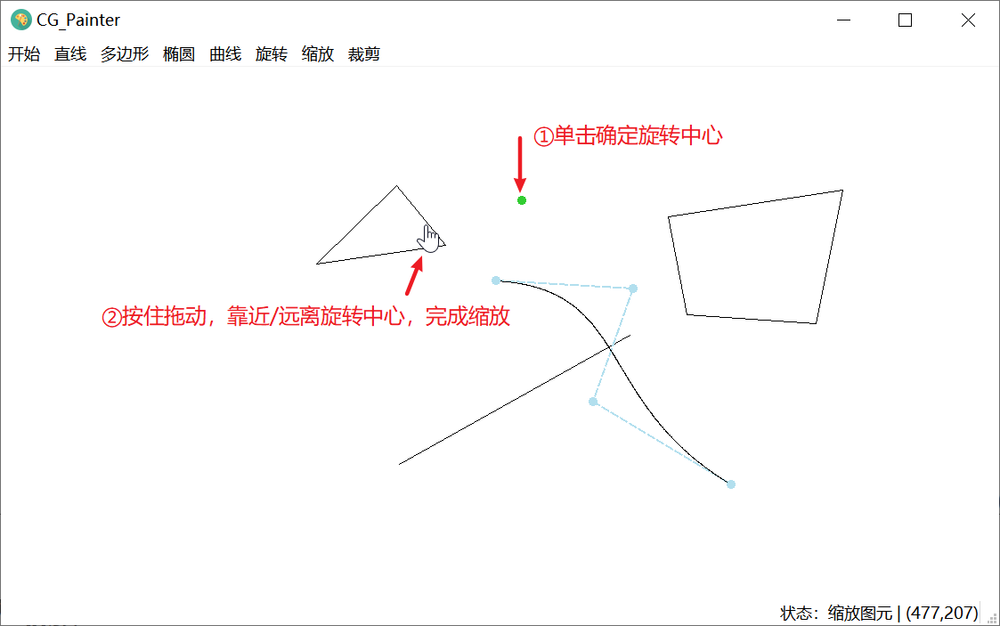

### 2.9 裁剪

点击“裁剪”选项，在弹出的菜单项中，选择使用的裁剪算法后，进入“线段裁剪”状态（右下角提示）。之后，单击左键后移动鼠标，移动鼠标，绿色矩形的裁剪框的随鼠标移动而改变。再次单击左键，即可完成裁剪。

注：这里的裁剪框是对画布上的所有直线图元而言，裁剪后保留框内的线段部分。

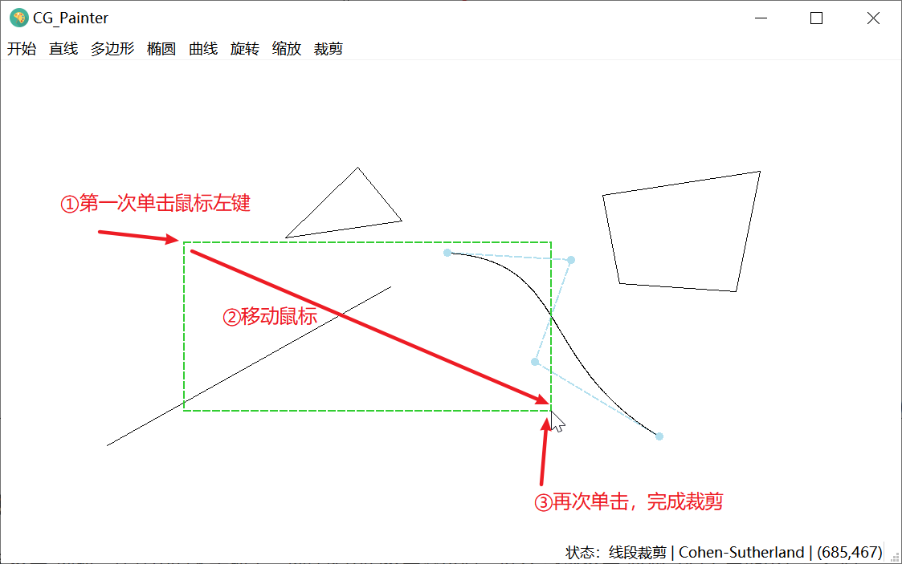

### 2.10 删除图元

鼠标靠近图元后，按下右键，在弹出的菜单中，选择“删除”，即可删除对应图元。

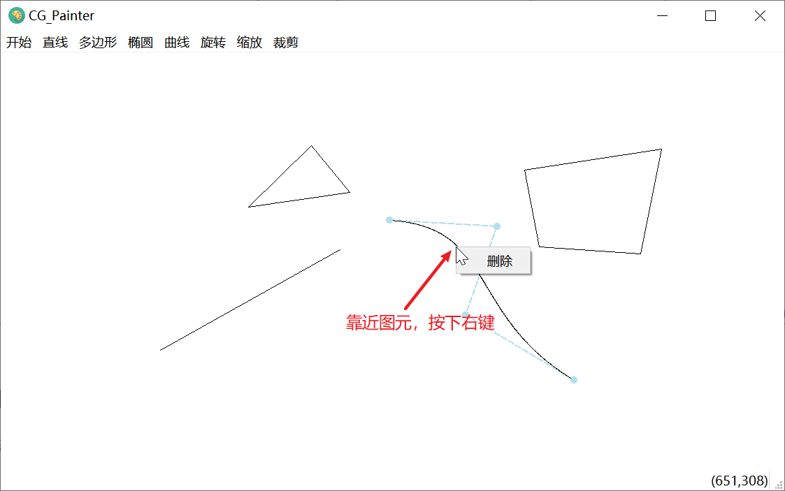
